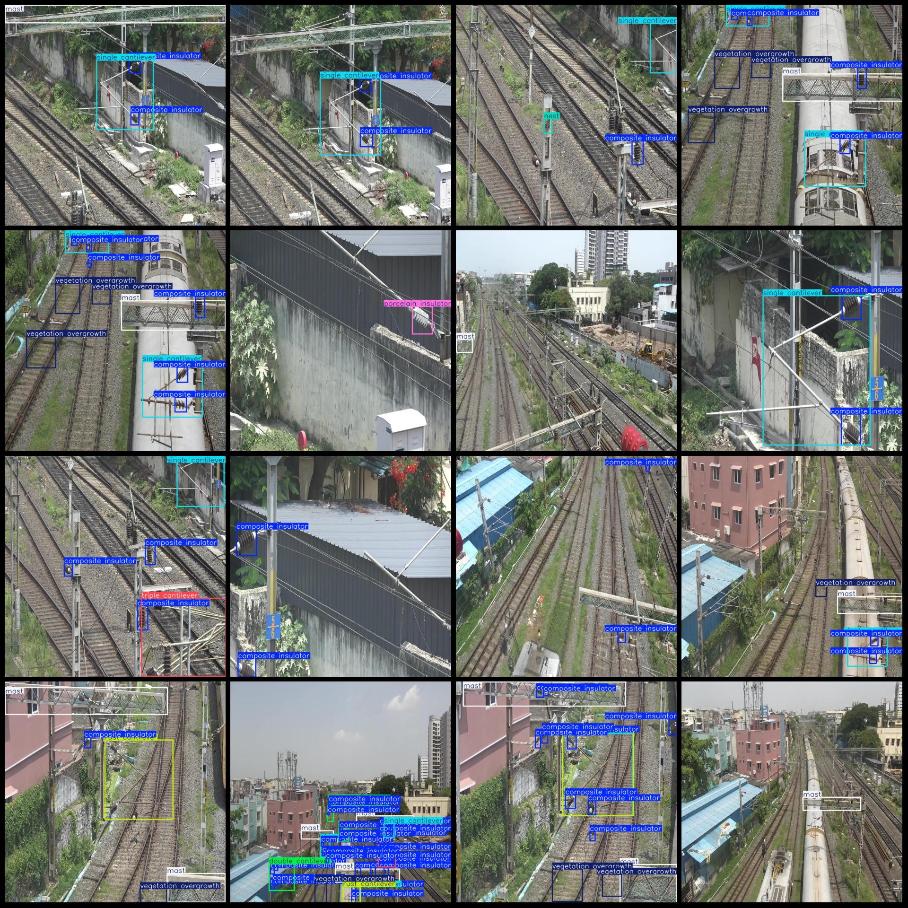
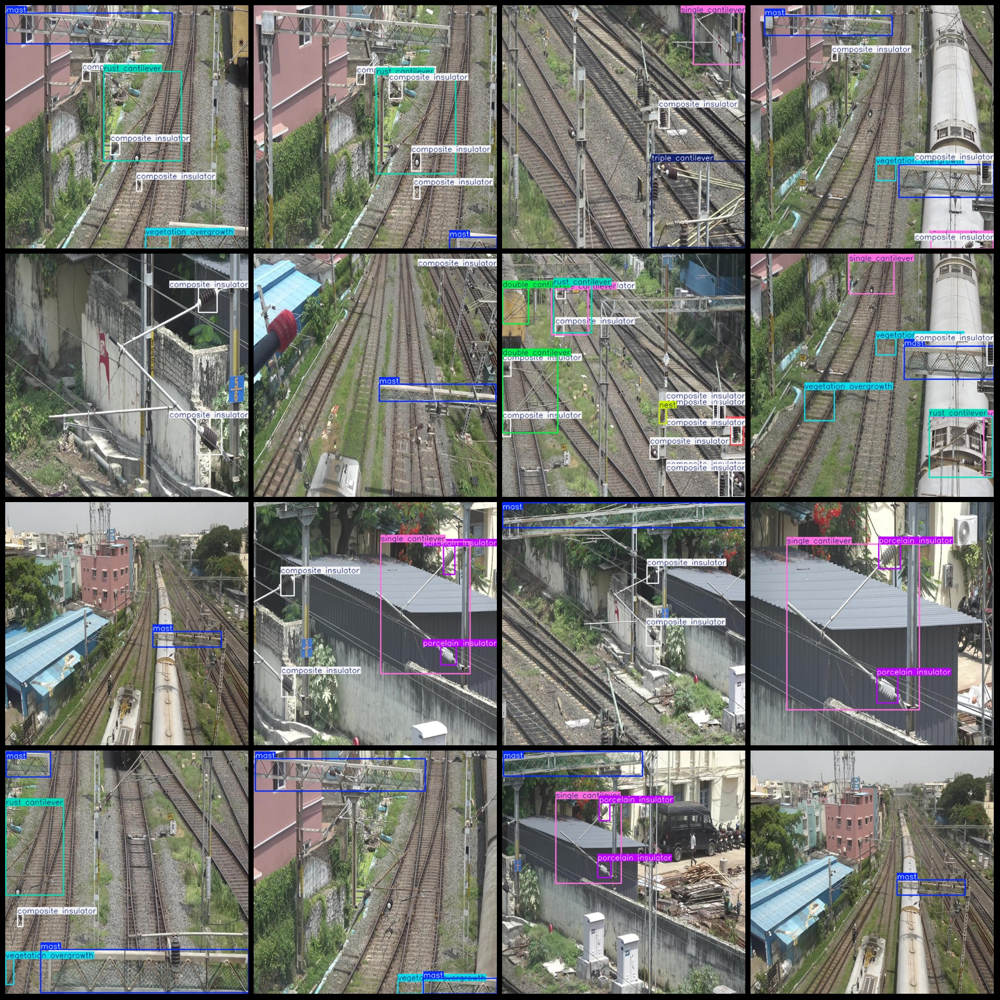

# Intelligent Traffic, Railway Patrol Abnormality Detection, Defect Detection, Railway Equipment Inspection Dataset VOC+YOLO Format 1695 Images in 10 Categories

Dataset format: Pascal VOC format+YOLO format (without split path in txtfile, only contain jpgimage and corresponding VOC format xmlfile and yolo format txtfile)
number of images: 1695  
annotation count: 1695  
annotation count: 1695  
annotationnumber of classes: 10  
["Composite insulator","Double cantilever","Flash","Mast","Nest","Porcelain insulator","Rust cantilever","Single cantilever","Triple cantilever","Vegetation overgrowth"]
boxes per class:   
composite insulator box count = 3063
double cantilever box count = 206
flash box count = 25
mast box count = 1339
nest box count = 182
porcelain insulator box count = 567
rust cantilever box count = 385
single cantilever box count = 955
triple cantilever box count = 184
vegetation overgrowth box count = 779
total boxes: 7685  
image resolution: 640x640  
Using annotation tool: labelImg
Annotation rules: Draw a rectangle around the class.
Important notes: There are no special statements.
Special statement: This dataset does not guarantee the accuracy of the trained model or weight file.
Image preview:
## Images

Here is a pay link on Stripe ( https://buy.stripe.com/3cs8yP7sY87d0vu9AB ). Please contact me lonlonago@foxmail.com after funding $89, and I will send you a complete data files , thank you!

